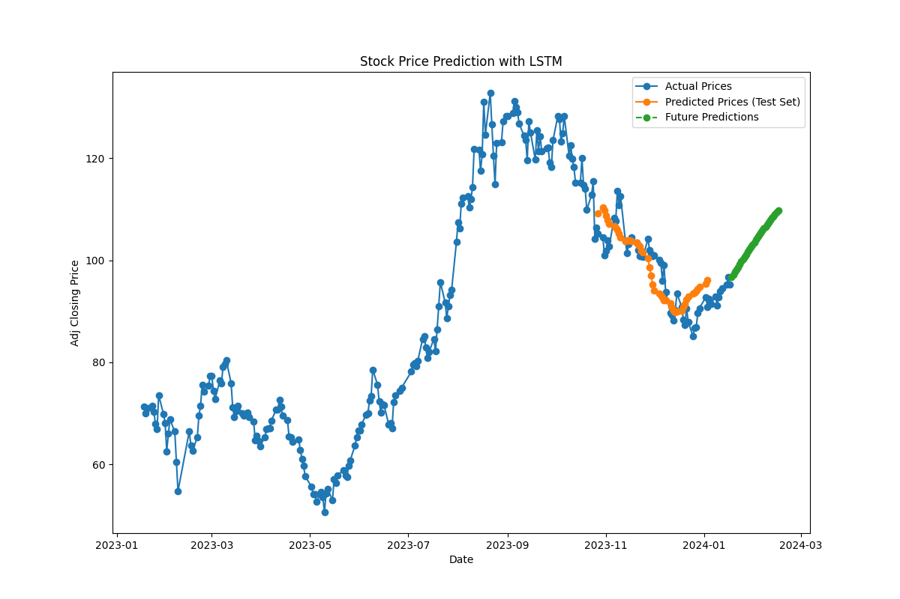

# Stock Price Prediction with LSTM

This Python script (`predict.py`) utilizes Long Short-Term Memory (LSTM) neural networks to predict stock prices. The implementation uses historical stock price data obtained using the Yahoo Finance API (`yfinance` library). The LSTM model is built using the Keras library with TensorFlow as the backend.

## Overview

1. **Setting Up Environment**
   - Importing necessary libraries (e.g., `yfinance`, `numpy`, `pandas`, `matplotlib`, `tensorflow`).
   - Setting a fixed random seed for reproducibility.

2. **Data Retrieval and Preprocessing**
   - Defining the stock ticker symbol (e.g., "ALARK.IS").
   - Downloading historical stock price data for the last year.
   - Handling missing data.
   - Preparing and normalizing the data for LSTM prediction.

3. **LSTM Model Building and Training**
   - Creating sequences for LSTM input.
   - Splitting the data into training and testing sets.
   - Building an LSTM model with a specified architecture.
   - Training the model on the training set.

4. **Model Evaluation**
   - Making predictions on the test set.
   - Inverse transforming predictions to the original scale.
   - Evaluating the model performance using Mean Squared Error (MSE).

5. **Future Price Prediction**
   - Predicting stock prices for a specified number of future days.
   - Displaying day-by-day predictions with percentage differences.

6. **Visualization**
   - Plotting actual prices, predicted prices on the testing set, and future predictions.

## Instructions for Use

1. **Requirements**
   - Install required libraries: `yfinance`, `numpy`, `pandas`, `matplotlib`, `tensorflow`, `keras`.

2. **Run the Script**
   - Ensure Python is installed on your system.
   - Open a terminal or command prompt.
   - Navigate to the directory containing `predict.py`.
   - Run the script using the command:
     ```bash
     python predict.py
     ```
   - Note: Make sure you have an internet connection for data retrieval from Yahoo Finance.

3. **Results**
   - The script outputs the Mean Squared Error on the test data and provides day-by-day predictions for future stock prices with percentage differences.

4. **Visualization**
   - A plot is generated showing actual prices, predicted prices on the testing set, and future predictions.

   

## Notes
- Adjust the `ticker_symbol` variable in `predict.py` to the desired stock.
- Modify the LSTM model architecture and hyperparameters in the script for experimentation.
- This script is for educational purposes only and should not be considered financial advice. Predicting stock prices is inherently uncertain, and results may vary. Make financial decisions based on careful consideration and consultation with a qualified financial advisor.

Feel free to customize and extend the script as needed for your specific use case.
